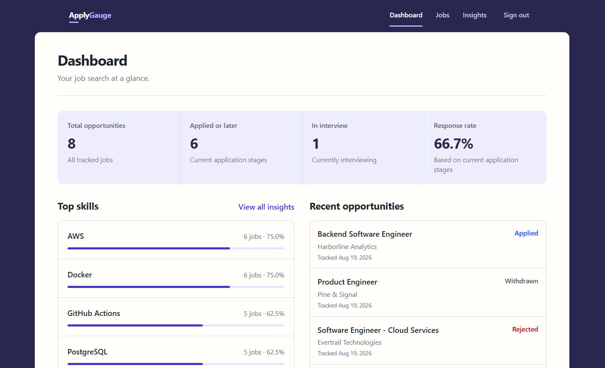
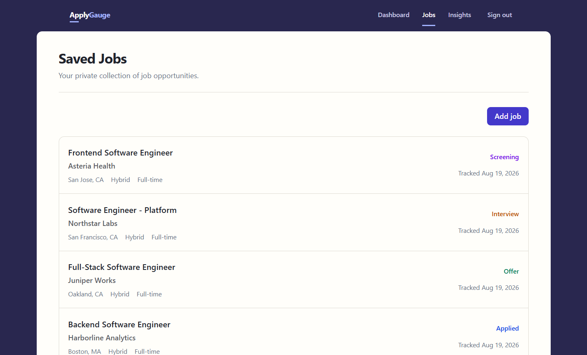
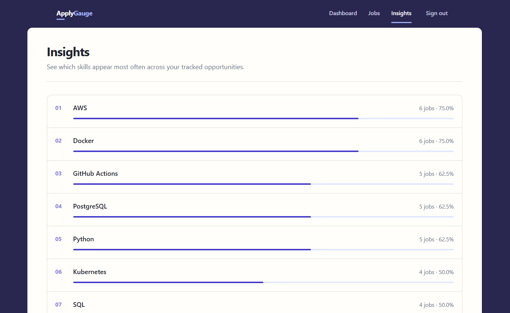
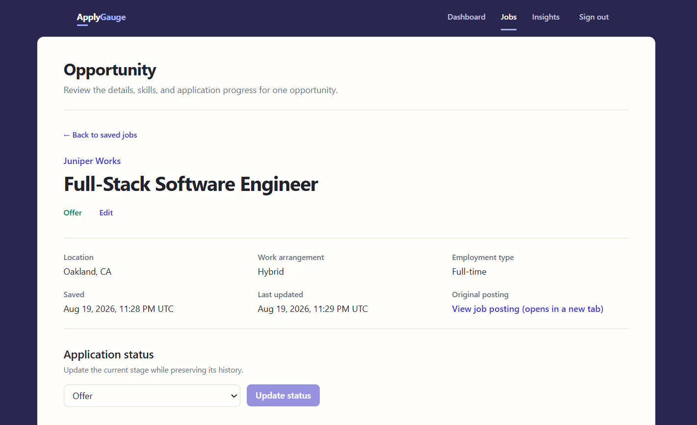

# ApplyGauge

ApplyGauge is a full-stack job-search intelligence workspace for tracking opportunities,
application progress, and technology demand across a user's saved jobs.

The v1 implementation is complete and is undergoing final release verification.

## Why ApplyGauge

Job seekers collect opportunities across many job boards, bookmarks, and documents. As that list
grows, it becomes difficult to understand both application progress and which technologies appear
consistently across target roles. ApplyGauge keeps those decisions in one private workspace and
turns saved job descriptions into explainable, current-snapshot insights.

## Screenshots



<table>
  <tr>
    <td width="50%"></td>
    <td width="50%"></td>
  </tr>
</table>



## Features

- **Opportunity tracking:** create, inspect, edit, and delete private job opportunities with
  resolved company records and useful role metadata.
- **Application progress:** maintain a checked current status alongside immutable, chronological
  status events with concurrency-safe transitions.
- **Skill intelligence:** resolve a curated canonical vocabulary and aliases, add skills manually,
  and extract reviewed terms deterministically from job descriptions.
- **Explainable correction:** retain independent manual/detected provenance and durable
  false-positive suppression without probabilistic or opaque processing.
- **Current-snapshot analytics:** view opportunity totals, application metrics, response rate,
  recent jobs, top-five Dashboard skills, and the complete deterministic Insights ranking.
- **Private, polished workspace:** Supabase email/password authentication, strict per-user isolation,
  responsive layouts, keyboard focus, and distinct loading, empty, error, and not-found states.

## Architecture

```text
Browser
  |-- Supabase Auth (identity and cookie-backed sessions)
  |
  v
Next.js / React / TypeScript
  |
  | authenticated HTTP/JSON
  v
FastAPI / Python
  |
  | SQLAlchemy
  v
ApplyGauge PostgreSQL
```

Next.js owns presentation and browser interaction. FastAPI owns validation, authorization,
business rules, analytics semantics, and all domain persistence. PostgreSQL owns relational
application data. Supabase provides identity only: normal domain operations never bypass FastAPI
or use Supabase-generated database APIs.

The backend is a modular monolith. The primary development loop runs Next.js and FastAPI locally,
the ApplyGauge database through Docker Compose, and a separate local Supabase stack for Auth. See
the [architecture overview](docs/architecture/overview.md).

## Technical highlights

- Token-derived ownership on every protected backend query, with cross-user integration coverage.
- Composite same-owner foreign keys that reinforce application authorization at the database
  boundary.
- Transactional immutable status history and `SELECT FOR UPDATE` serialization for concurrent
  transitions.
- A global canonical skill vocabulary with one deterministic exact-term namespace.
- Synchronous deterministic extraction using explicitly reviewed terms and punctuation-aware
  matching.
- Independent manual/detected provenance plus durable per-job false-positive correction.
- Backend-defined analytics with deterministic counts, percentages, ranking, and current-snapshot
  response-rate semantics.
- Real PostgreSQL integration and concurrency tests, Alembic migration/drift checks, strict typing,
  linting, component tests, and production builds in CI.

## Technology stack

| Area | Technology |
| --- | --- |
| Frontend | Next.js, React, TypeScript, Tailwind CSS |
| Backend | Python 3.13, FastAPI, Pydantic, SQLAlchemy, Alembic |
| Data and identity | PostgreSQL 17, Supabase Auth, ES256/JWKS |
| Frontend quality | Vitest, React Testing Library, ESLint, Prettier, TypeScript |
| Backend quality | Pytest, Ruff, mypy, real PostgreSQL integration tests |
| Tooling | npm workspaces, uv, Docker Compose, GitHub Actions |

## Repository structure

```text
applygauge/
|-- .github/workflows/       # Continuous integration
|-- apps/
|   |-- api/                 # FastAPI source, tests, and Alembic environment
|   `-- web/                 # Next.js application and frontend tests
|-- docs/
|   |-- api/                 # Current HTTP API behavior
|   |-- architecture/        # System overview
|   |-- authentication/      # Local Supabase development
|   |-- decisions/           # ADRs 001-011
|   |-- testing/             # Manual acceptance and release checklists
|   `-- PROJECT_SPEC.md      # Authoritative product specification
|-- supabase/                # Local Auth configuration and email template
|-- docker-compose.yml       # ApplyGauge PostgreSQL only
|-- package.json             # Root npm workspace commands
`-- package-lock.json        # Single Node lockfile
```

## Local development

### Prerequisites

- Git
- Node.js 20.19 or newer and npm 10 or newer
- Python 3.13
- [uv](https://docs.astral.sh/uv/)
- Docker Desktop or another Docker Engine with Compose

All required development tooling is free. Supabase CLI 2.114.0 is locked through the root npm
lockfile.

### 1. Install locked dependencies

From the repository root:

```bash
npm ci
cd apps/api
uv sync --frozen
cd ../..
```

### 2. Create local environment files

PowerShell:

```powershell
Copy-Item .env.example .env
Copy-Item apps/api/.env.example apps/api/.env
Copy-Item apps/web/.env.example apps/web/.env.local
```

macOS/Linux:

```bash
cp .env.example .env
cp apps/api/.env.example apps/api/.env
cp apps/web/.env.example apps/web/.env.local
```

These copies are ignored. Root `.env` configures the ApplyGauge PostgreSQL container;
`apps/api/.env` contains private backend settings; and `apps/web/.env.local` contains public browser
configuration. Never place private keys or service-role credentials in a `NEXT_PUBLIC_` variable.

### 3. Initialize the local Supabase signing key once

The private `supabase/signing_keys.json` file is ignored. Supabase CLI 2.114.0 requires an empty
array before generating the first ES256 key.

PowerShell:

```powershell
Set-Content -Path supabase/signing_keys.json -Value '[]' -NoNewline
npx --no-install supabase gen signing-key --algorithm ES256 --workdir . --yes
git check-ignore supabase/signing_keys.json
```

macOS/Linux:

```bash
printf '[]' > supabase/signing_keys.json
npx --no-install supabase gen signing-key --algorithm ES256 --workdir . --yes
git check-ignore supabase/signing_keys.json
```

Do not print or commit this file. The compatibility details and Windows port map are documented in
the [local authentication guide](docs/authentication/local-development.md).

### 4. Start the ApplyGauge application database

```bash
docker compose up -d postgres
docker compose ps
docker compose exec -T postgres pg_isready -U applygauge -d applygauge
```

This database listens on `localhost:5432` and stores ApplyGauge domain data.

### 5. Apply application migrations

From `apps/api`:

```bash
uv run alembic upgrade head
uv run alembic current
uv run alembic check
```

The current v1 head is `20260818_0004`. Migrations must run before starting normal application use.

### 6. Start local Supabase Auth

From the repository root:

```bash
npx --no-install supabase start --workdir .
npx --no-install supabase status --workdir .
```

Supabase uses its own Auth database on `localhost:54532`; it does not contain ApplyGauge domain
data. Copy the displayed public/publishable key into
`NEXT_PUBLIC_SUPABASE_PUBLISHABLE_KEY` in `apps/web/.env.local`. Never copy a service-role or secret
key into frontend configuration.

The Auth gateway is `http://127.0.0.1:55021`, email capture is
`http://127.0.0.1:55124`, and Analytics and Studio are intentionally disabled.

### 7. Start FastAPI

From `apps/api` in its own terminal:

```bash
uv run uvicorn applygauge_api.main:app --reload
```

FastAPI runs at `http://localhost:8000`; OpenAPI is available at
`http://localhost:8000/docs`.

### 8. Start Next.js

From the repository root in another terminal:

```bash
npm run dev:web
```

Open `http://localhost:3000`.

### 9. Verify health and readiness

```bash
curl http://localhost:8000/api/v1/health
curl http://localhost:8000/api/v1/health/ready
```

Expected bodies are `{"status":"ok"}` and `{"status":"ready"}`. Liveness checks the API process;
readiness also executes a PostgreSQL query.

### Shutdown

1. Stop the Next.js and FastAPI terminals with `Ctrl+C`.
2. Stop Supabase without resetting its data:

   ```bash
   npx --no-install supabase stop --workdir .
   ```

3. Stop the ApplyGauge database containers while retaining the named data volume:

   ```bash
   docker compose down
   ```

Do not use `docker compose down -v` for routine shutdown. The `-v`/`--volumes` option permanently
removes the local ApplyGauge database volume.

## Development and testing

Frontend commands run from the repository root:

```bash
npm run format:web
npm run lint:web
npm run typecheck:web
npm run test:web
npm run build:web
```

Backend commands run from `apps/api`:

```bash
uv run ruff format --check .
uv run ruff check .
uv run mypy
uv run pytest
uv run alembic check
```

Run the complete database-backed backend suite after PostgreSQL is healthy:

```powershell
$env:RUN_DATABASE_INTEGRATION="1"
uv run pytest
```

```bash
RUN_DATABASE_INTEGRATION=1 uv run pytest
```

The suite includes unit/component, API/OpenAPI, ownership, real PostgreSQL integration,
concurrency, migration, and drift coverage. CI performs frozen installs, formatting, linting,
strict type checks, frontend tests/build, database migrations, and backend tests against a
PostgreSQL service container. It performs no deployment.

## Design

The v1 interface uses a deep indigo application frame, a warm continuous workspace, pale lavender
analytics grouping, restrained semantic status colors, and explicit focus-visible treatment.
Responsive layouts preserve full content rather than hiding important job or skill data.

## Documentation

- [Project specification](docs/PROJECT_SPEC.md)
- [Architecture overview](docs/architecture/overview.md)
- [Architecture decisions](docs/decisions/)
- [API documentation](docs/api/)
- [Local Supabase authentication](docs/authentication/local-development.md)
- [Detailed Milestone 6 UI acceptance](docs/testing/milestone-6-manual-acceptance.md)
- [V1 release checklist](docs/testing/v1-release-checklist.md)

## Limitations and post-v1 direction

V1 intentionally has no job search/filtering, notes or salary fields, historical funnels/trends,
recommendations, resume comparison, semantic/AI extraction, browser extension, or scraping. There
are no separate Applications or Settings pages. ApplyGauge currently has a local-first release
posture and does not claim a public demo. Future work remains subject to the $0 budget and explicit
scope approval.

## Budget

ApplyGauge has a hard **$0 budget**. Local development must not depend on paid APIs, hosting,
storage, or infrastructure, and the core application remains portable if free services change.
